# Курсовой проект. Контейнеризация и оркестрация веб-приложения

**Студент:** Сторожев Данила Валерьевич, группа бИСТ-232  
**Дисциплина:** Облачные технологии  
**Тема:** Контейнеризация и оркестрация веб-приложения: от исходного кода до развертывания в кластере  
**Руководитель:** Н.А. Рындин  
**Год:** 2026  

---

## Информация о работе

В рамках данной курсовой работы по дисциплине «Облачные технологии» рассматриваются подходы к контейнеризации приложений и управлению их жизненным циклом. В ходе выполнения работы были собраны Docker-образы для backend- и frontend-частей системы, организовано локальное окружение с использованием Docker Compose, а также выполнено развертывание приложения в Kubernetes-кластере Minikube.

Отдельное внимание уделено механизмам автоматического масштабирования, восстановлению работоспособности после сбоев, процессам обновления версий приложения и вопросам обеспечения базового уровня безопасности контейнерной среды.

**Используемая среда выполнения:**

- операционная система: Debian GNU/Linux 13 (trixie) x86_64;
- контейнерная платформа: Docker Desktop;
- локальный Kubernetes-кластер: minikube;
- инструменты управления: Docker CLI, Docker Compose, kubectl;
- база данных: PostgreSQL;
- backend: Node.js, Express;
- frontend: HTML, nginx.

# Содержание

- [Введение](#введение)
- [Этап 1. Контейнеризация компонентов](#этап-1-контейнеризация-компонентов)
- [Этап 2. Локальная композиция (Docker Compose)](#этап-2-локальная-композиция-docker-compose)
- [Этап 3. Развертывание в локальном кластере Kubernetes](#этап-3-развертывание-в-локальном-кластере-kubernetes)
- [Этап 4. Обновление и масштабирование](#этап-4-обновление-и-масштабирование)
- [Этап 5. Безопасность](#этап-5-безопасность)
- [Заключение](#заключение)

# Введение

Стремительное развитие облачных платформ и микросервисных подходов делает контейнеризацию и системы оркестрации ключевыми инструментами при публикации веб-приложений. Современные стандарты создания ПО требуют поддержки оперативного масштабирования, автоматизированного деплоя и гарантированной стабильности работы в любых условиях — от локальных стендов разработчика до промышленных кластеров.
Технология контейнеризации позволяет упаковать программный код вместе со всеми необходимыми библиотеками в изолированную среду, что гарантирует идентичное поведение системы вне зависимости от особенностей хостовой инфраструктуры. Платформы оркестрации, в частности Kubernetes, дополняют эту модель, автоматизируя управление жизненным циклом контейнеров, распределение сетевого трафика, динамическое изменение количества экземпляров и самовосстановление сервисов при возникновении сбоев.
Цель данной курсовой работы заключается в теоретическом освоении и практической реализации процессов контейнеризации и оркестрации на примере веб-сервиса, архитектура которого включает серверную часть на Node.js, клиентский интерфейс на базе Nginx и систему хранения данных PostgreSQL, с последующим развёртыванием в локальном кластере Kubernetes.
Для достижения поставленной цели необходимо выполнить ряд этапов: подготовить Docker-образы для каждого модуля системы, настроить их межсервисное взаимодействие посредством Docker Compose, осуществить миграцию в среду Kubernetes, а также наглядно продемонстрировать процедуры бесшовного обновления, горизонтального масштабирования и применения политик безопасности контейнеров.
Итогом выполнения проекта станет работоспособная распределённая платформа, иллюстрирующая базовые принципы построения современных облачных экосистем и внедрения DevOps-практик в процессы разработки и эксплуатации программного обеспечения.

# Этап 1. Контейнеризация компонентов
# 1.1 Подготовка рабочего окружения

## Цель этапа
На данном этапе выполняется проверка установленного программного обеспечения Docker и подтверждение готовности среды для выполнения курсового проекта по контейнеризации и оркестрации веб-приложения.

---


### Проверка версии Docker

В терминале выполнена команда:

```bash
docker --version
```

Данная команда позволяет определить, установлен ли Docker в системе и какая версия используется.

### Проверка состояния Docker Engine

В терминале выполнена команда:

```
docker info
```

Команда выводит подробную информацию о состоянии Docker Engine, включая:

количество запущенных контейнеров;
настройки системы;
конфигурацию storage driver;
общую информацию о среде выполнения.

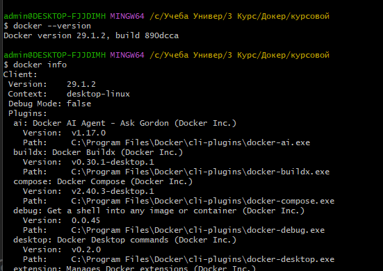

Рисунок 1 - результат выполненных команд


## 1.2 Создание файлов .dockerignore

На данном этапе выполняется создание файлов `.dockerignore` для backend и frontend компонентов. Эти файлы позволяют исключить ненужные каталоги и файлы из контекста сборки Docker, что уменьшает размер образов и ускоряет процесс сборки.

---

### Создание файла

Для каталогов frontend и backend были созданы файлы .dockerignore

Содержимое файла .dockerignore для backend

```
node_modules
npm-debug.log
Dockerfile
.git
.gitignore
```

Содержимое файла .dockerignore для frontend

```
node_modules
npm-debug.log
.git
.gitignore
```

# 1.3 Dockerfile для backend
В ходе выполнения этапа был создан Dockerfile для backend-приложения на Node.js.
Он реализует многоэтапную (multi-stage) сборку, позволяющую разделить процесс установки зависимостей и формирование финального образа.

Ниже приведено содержимое Dockerfile:

## Этап 1: установка зависимостей
```
FROM node:22-alpine AS build

WORKDIR /app

COPY package*.json ./
RUN npm ci

COPY . .
```

## Этап 2: финальный образ

```
FROM node:22-alpine

WORKDIR /app

COPY --from=build /app /app

USER node

EXPOSE 8000

HEALTHCHECK --interval=30s --timeout=5s --start-period=10s --retries=3 \
  CMD wget --quiet --spider http://localhost:8000/api/health || exit 1

CMD ["node", "app.js"]

```

На первом этапе используется базовый образ node:22-alpine, в котором выполняется установка зависимостей с помощью команды npm ci. Данный способ установки гарантирует полное соответствие зависимостям, указанным в package-lock.json, и обеспечивает воспроизводимость сборки. После установки зависимостей в контейнер копируется исходный код backend-приложения.

На втором этапе формируется финальный минимизированный образ. В него копируются только необходимые файлы из первого этапа, что позволяет существенно уменьшить размер итогового Docker-образа и повысить эффективность его использования.

Для повышения безопасности приложение запускается от непривилегированного пользователя node, что ограничивает права процесса внутри контейнера и снижает потенциальные риски.

Дополнительно добавлена инструкция HEALTHCHECK, которая периодически проверяет доступность API по адресу /api/health. Это позволяет Docker отслеживать состояние контейнера и определять его работоспособность.

Запуск приложения осуществляется с помощью команды:

CMD ["node", "app.js"]

Использование exec-формы обеспечивает корректную обработку системных сигналов и стабильное завершение процесса.


## 1.4 Dockerfile для frontend

Для frontend-компонента был создан отдельный Dockerfile в каталоге docker/frontend.

В Dockerfile используется образ nginx:1.27-alpine, предназначенный для обслуживания статических файлов и работы в качестве веб-сервера.

Содержимое Dockerfile:

```
FROM nginx:1.27-alpine
```

### Копирование статических файлов
```
COPY index.html /usr/share/nginx/html/
```

### Копирование конфигурации nginx
```
COPY nginx.conf /etc/nginx/conf.d/default.conf
```

### Открытие HTTP-порта

```
EXPOSE 80
```


### Проверка доступности nginx
```
HEALTHCHECK --interval=30s --timeout=5s --retries=3 \
  CMD wget --quiet --spider http://localhost:80/ || exit 1

```

В процессе сборки в контейнер копируется статическая веб-страница index.html, которая размещается в стандартном каталоге nginx /usr/share/nginx/html/.

Также в контейнер копируется пользовательский файл конфигурации nginx.conf, заменяющий стандартную конфигурацию nginx. Это необходимо для настройки reverse proxy и корректного взаимодействия frontend с backend API.

Для проверки состояния контейнера добавлена инструкция HEALTHCHECK, выполняющая HTTP-запрос к локальному nginx-серверу.

В качестве базового образа используется nginx:1.27-alpine, позволяющий уменьшить размер итогового Docker-образа за счёт использования Alpine Linux.


## 1.5 Сборка и проверка образов

После создания Dockerfile для backend и frontend была выполнена сборка Docker-образов.

Сборка backend-образа выполнялась командой:
```
docker build -t notes-backend:1.0 -f docker/backend/Dockerfile app/backend/
```
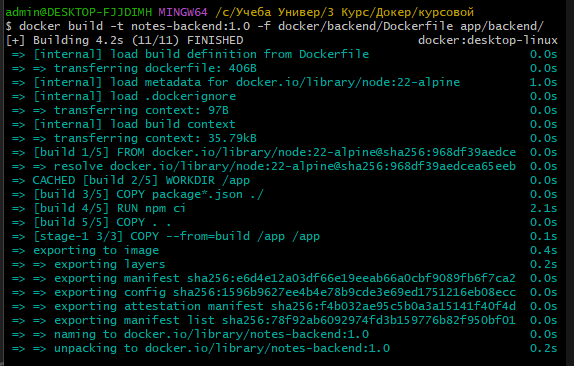

Рисунок 2 - сборка backend образа


Сборка frontend-образа выполнялась командой:

```
docker build -t notes-frontend:1.0 -f docker/frontend/Dockerfile app/frontend/
```

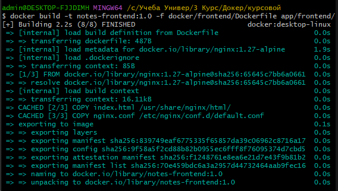

Рисунок 3 - сборка frontend образа


В параметре -t задаётся имя и тег Docker-образа.
Параметр -f указывает путь к Dockerfile, а последний аргумент определяет контекст сборки.

После завершения сборки была выполнена проверка созданных образов:

```
docker images | grep notes
```
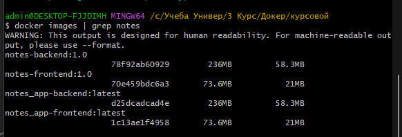

Рисунок 4 - проверка созданных образов


Команда позволяет вывести список Docker-образов, относящихся к проекту.

Для анализа структуры слоёв backend-образа использовалась команда:

```
docker history notes-backend:1.0
```

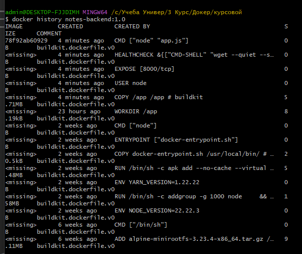

Рисунок 5 - анализ структуры слоев backend образа.

С помощью данной команды можно просмотреть историю формирования Docker-образа и размеры отдельных слоёв.

После сборки был выполнен запуск backend-контейнера для проверки корректности старта приложения:

```
docker run --rm -p 8000:8000 notes-backend:1.0
```
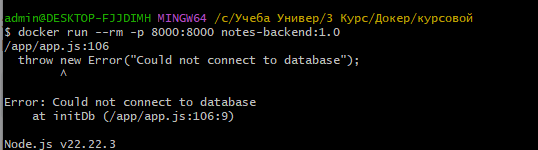

Рисунок 6 - запуск контейнера

Параметр --rm автоматически удаляет контейнер после завершения работы, а параметр -p 8000:8000 публикует порт приложения.

При запуске контейнера backend-приложение выдало ошибку соединения с бд, как и ожидалось.

# Этап 2. Локальная композиция (Docker Compose)

## 2.1 Создание файла docker-compose.yml

В корневом каталоге проекта был создан файл docker-compose.yml, предназначенный для описания всех сервисов приложения, сетевого взаимодействия между ними и используемых томов хранения данных.

## 2.2 Сервис db (PostgreSQL)

Для хранения заметок в приложении используется СУБД PostgreSQL. В качестве контейнера применяется официальный образ postgres:17-alpine, не требующий создания собственного Dockerfile.

В сервисе были настроены переменные окружения для создания базы данных и пользователя при первом запуске контейнера. Значения переменных будут считываться из файла .env, который будет создан на следующем этапе.

Также для сохранения данных между перезапусками контейнера был подключён именованный том postgres_data, монтируемый в каталог /var/lib/postgresql/data.

В файл docker-compose.yml была добавлена следующая конфигурация:

```
services:
  db:
    image: postgres:17-alpine
    container_name: notes-db

    environment:
      POSTGRES_DB: ${DB_NAME}
      POSTGRES_USER: ${DB_USER}
      POSTGRES_PASSWORD: ${DB_PASSWORD}

    volumes:
      - postgres_data:/var/lib/postgresql/data

    networks:
      - notes-network

    restart: unless-stopped

    deploy:
      resources:
        limits:
          cpus: "0.5"
          memory: 512M

```
## 2.3 Сервис backend

Для запуска серверной части приложения в файл docker-compose.yml был добавлен сервис backend.

Сборка контейнера выполняется на основе Dockerfile, созданного на предыдущем этапе. В качестве контекста сборки используется каталог app/backend, содержащий исходный код приложения.

Для подключения к базе данных сервису передаются параметры подключения через переменные окружения. В качестве имени хоста базы данных используется db, так как Docker Compose автоматически создаёт DNS-запись по имени сервиса.

Также была настроена зависимость от сервиса базы данных через секцию depends_on, что обеспечивает запуск контейнера PostgreSQL до запуска backend-приложения.

В файл docker-compose.yml был добавлен следующий блок:

```
  backend:
    build:
      context: ./app/backend
      dockerfile: ../../docker/backend/Dockerfile

    container_name: notes-backend

    environment:
      DB_HOST: db
      DB_PORT: 5432
      DB_NAME: ${DB_NAME}
      DB_USER: ${DB_USER}
      DB_PASSWORD: ${DB_PASSWORD}

    depends_on:
      db:
        condition: service_started

    networks:
      - notes-network

    restart: unless-stopped

    deploy:
      resources:
        limits:
          cpus: "0.5"
          memory: 256M

```


## 2.4 Сервис frontend

Для предоставления пользовательского веб-интерфейса в конфигурацию Docker Compose был добавлен сервис frontend.

Сервис собирается на основе Dockerfile, созданного на этапе контейнеризации. В качестве контекста сборки используется каталог app/frontend, содержащий статические файлы веб-приложения и конфигурацию nginx.

Для обеспечения доступа к приложению из браузера был опубликован порт 80 контейнера на порт 80 хостовой системы.

Для корректного взаимодействия с backend-сервисом была настроена зависимость через секцию depends_on. После запуска nginx будет обращаться к backend по имени сервиса backend, используя встроенную систему DNS Docker Compose.

Также сервис был подключён к пользовательской сети проекта и настроен на автоматический перезапуск при возникновении ошибок.

В файл docker-compose.yml был добавлен следующий блок:

```
  frontend:
    build:
      context: ./app/frontend
      dockerfile: ../../docker/frontend/Dockerfile

    container_name: notes-frontend

    ports:
      - "80:80"

    depends_on:
      - backend

    networks:
      - notes-network

    restart: unless-stopped

    deploy:
      resources:
        limits:
          cpus: "0.25"
          memory: 128M

```

## 2.5 Файл переменных окружения (.env)

Для хранения параметров конфигурации базы данных был создан файл .env в корневом каталоге проекта.

Docker Compose автоматически считывает значения из данного файла и подставляет их в конфигурацию docker-compose.yml при запуске сервисов.

В файл были добавлены следующие параметры:

```
DB_NAME=notes
DB_USER=notes
DB_PASSWORD=notes
```

Использование отдельного файла переменных окружения позволяет централизованно управлять параметрами конфигурации приложения и избегать дублирования значений в нескольких местах.

Переменные используются сервисами PostgreSQL и backend для настройки подключения к базе данных.

## 2.6 Пользовательская сеть

Для организации сетевого взаимодействия между контейнерами была создана пользовательская сеть Docker Compose.

В пользовательской сети каждый сервис получает собственное DNS-имя, совпадающее с именем сервиса в файле конфигурации. Благодаря этому контейнеры могут обращаться друг к другу по именам, например:

```
db
backend
frontend
```

В конец файла docker-compose.yml была добавлена секция сети:
```
networks:
  notes-network:
```

Также каждый сервис был подключён к данной сети через параметр:

```
networks:
  - notes-network
```

Использование отдельной сети обеспечивает изоляцию компонентов приложения от других контейнеров, работающих в системе Docker.


## 2.7 Ограничения ресурсов и политика перезапуска

Для повышения устойчивости работы приложения и предотвращения чрезмерного потребления ресурсов хостовой системы для каждого сервиса были настроены ограничения по использованию процессора и оперативной памяти.

Ограничения задавались через секцию:

```
deploy:
  resources:
    limits:
```

Для базы данных PostgreSQL были установлены следующие лимиты:

```
deploy:
  resources:
    limits:
      cpus: "0.5"
      memory: 512M
```

Для backend-сервиса:
```
deploy:
  resources:
    limits:
      cpus: "0.5"
      memory: 256M
```

Для frontend-сервиса:

```
deploy:
  resources:
    limits:
      cpus: "0.25"
      memory: 128M
```

Также для всех сервисов была настроена политика автоматического перезапуска:

```
restart: unless-stopped
```

Данная политика обеспечивает автоматический запуск контейнера после аварийного завершения работы. Контейнер не будет перезапущен только в случае его явной остановки пользователем.

Настройка ограничений ресурсов и политики перезапуска позволяет повысить надёжность работы приложения и предотвратить влияние одного сервиса на остальные компоненты системы.

## 2.8 Запуск и проверка

После подготовки конфигурации docker-compose.yml была выполнена сборка и запуск всех сервисов приложения.

Запуск выполнялся командой:
```
docker compose -p notes up --build
```

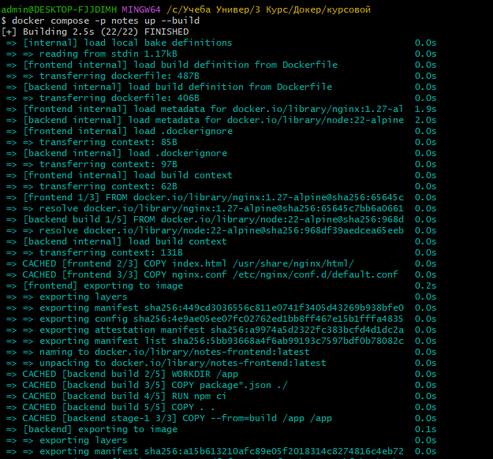

Рисунок 7 - запуск 


Во время запуска Docker Compose автоматически:

собрал Docker-образы для backend и frontend;
загрузил образ PostgreSQL;
создал пользовательскую сеть notes-network;
создал именованный том postgres_data;
запустил все три контейнера (db, backend, frontend).

Для проверки состояния запущенных сервисов использовалась команда:
```
 docker compose -p notes ps

```
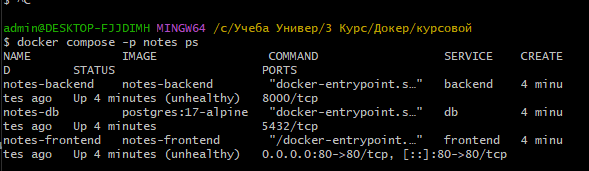

Рисунок 8 - просмотр запущенных сервисов

Для просмотра логов backend-сервиса использовалась команда:

```
docker compose -p notes logs backend
```

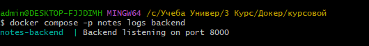

Рисунок 9 - просмотр логов бэкенда


Для проверки корректности работы приложения было выполнено:

открытие веб-интерфейса по адресу:
http://localhost
проверка доступности API backend через health endpoint;
создание и отображение заметок в интерфейсе приложения.
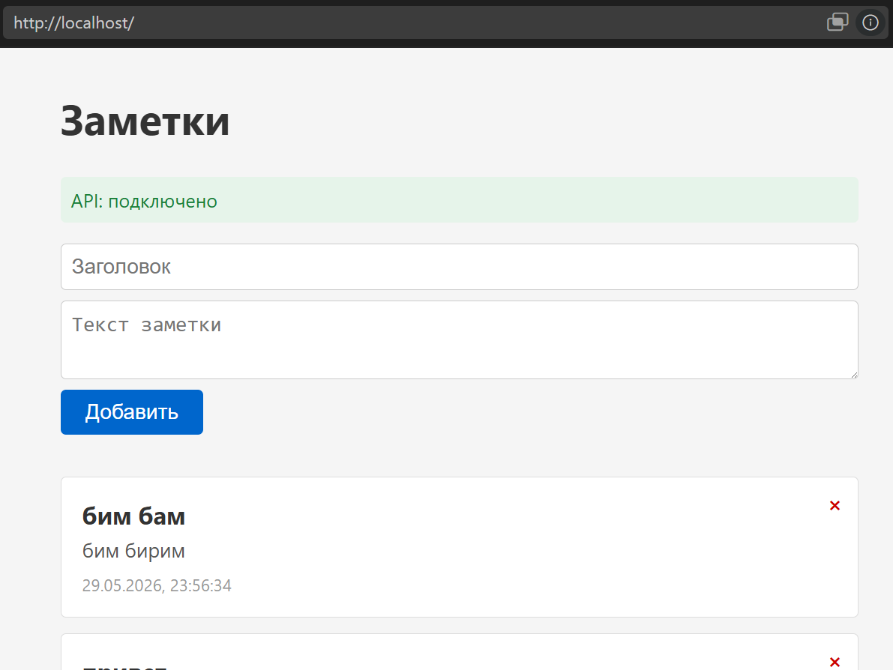

Рисунок 10 - проверка доступности api


Для проверки устойчивости хранения данных было выполнено:

```
docker compose -p notes down
docker compose -p notes up --build
```
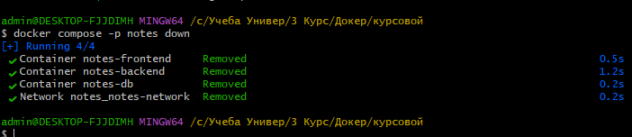

Рисунок 11 - остановка приложения


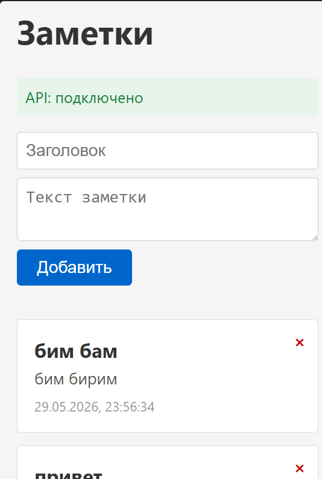

Рисунок 12 - сохранение данных после перезапуска


После повторного запуска данные, сохранённые в PostgreSQL, остались доступными, что подтверждает корректную работу именованного тома postgres_data.

# Этап 3. Развертывание в локальном кластере Kubernetes

## 3.1 Установка и настройка локального кластера

Для развертывания приложения в Kubernetes был использован локальный кластер Minikube. Перед началом работы была выполнена проверка наличия необходимых инструментов управления кластером.

Для проверки установленной версии Minikube использовалась команда:

```bash
minikube version
```

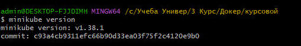

Рисунок 13 - проверка версии minikube


Для проверки клиента Kubernetes использовалась команда:
```
kubectl version --client
```
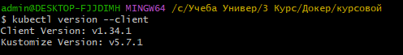

Рисунок 14 - проверка версии клиента

После проверки был выполнен запуск локального кластера Kubernetes:
```
minikube start --cpus=2 --memory=4096
```
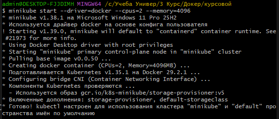

Рисунок 15 - запуск кластера

После успешного запуска кластера была выполнена проверка его состояния:

```
kubectl cluster-info
kubectl get nodes
```

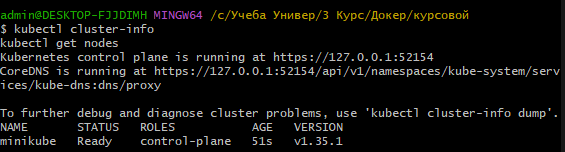

Рисунок 16 - проверка состояния кластера


В результате был создан локальный кластер Kubernetes, содержащий один управляющий узел, готовый для развертывания контейнеризированного приложения.

## 3.2 Загрузка образов в кластер

Для использования локально собранных Docker-образов внутри кластера Minikube была выполнена их загрузка во внутреннее хранилище образов.

Для backend-компонента использовалась команда:

```
minikube image load notes-backend:1.0
```
Для frontend-компонента использовалась команда:

```
minikube image load notes-frontend:1.0
```

После загрузки была выполнена проверка наличия образов в среде Minikube:

```
 minikube image ls | grep notes
```

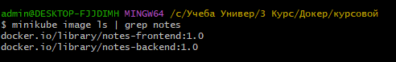

Рисунок 17 - проверка загруженных образов

В результате образы приложения стали доступны для использования в Kubernetes Deployment без необходимости загрузки из внешнего контейнерного реестра.

## 3.3 Организация манифестов

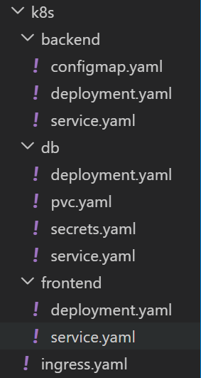

Рисунок 18 - организация манифестов

## 3.4 Манифесты для db
# 3.4 Манифесты для компонента database

Для развертывания базы данных PostgreSQL в кластере Kubernetes были подготовлены манифесты PersistentVolumeClaim, Secret, Deployment и Service.

Для хранения чувствительных данных был создан объект Secret с именем `db-secret`. В нем хранится пароль пользователя базы данных в формате Base64. Использование Secret позволяет исключить хранение пароля непосредственно в конфигурации контейнера.

Для обеспечения постоянного хранения данных PostgreSQL был создан объект PersistentVolumeClaim (`db-pvc`). В запросе на выделение хранилища был указан размер 1 ГБ и режим доступа `ReadWriteOnce`, позволяющий подключать том к одному узлу в режиме чтения и записи.

Развертывание базы данных описано в манифесте Deployment. Для запуска используется официальный контейнерный образ `postgres:17-alpine`. Количество реплик установлено равным одной, что соответствует требованиям проекта. Настройки базы данных передаются через переменные окружения, а пароль подключается из объекта Secret.

Для сохранения данных между перезапусками контейнера к PostgreSQL подключен постоянный том через PersistentVolumeClaim. Подключение выполнено с использованием параметра `subPath`, что соответствует рекомендациям по развертыванию PostgreSQL в Kubernetes.

Для организации сетевого взаимодействия внутри кластера создан Service типа `ClusterIP` с именем `db`. Благодаря этому остальные компоненты приложения могут обращаться к базе данных по DNS-имени:

```text
db:5432
```

Использование Service обеспечивает стабильное сетевое взаимодействие независимо от изменений IP-адресов отдельных Pod.

# 3.5 Манифесты для компонента backend

Для компонента backend были подготовлены ресурсы ConfigMap, Deployment и Service.

В ConfigMap `backend-config` размещены параметры подключения к базе данных: имя сервиса базы данных, порт подключения, имя базы данных и пользователь. Использование ConfigMap позволяет хранить параметры конфигурации отдельно от контейнерного образа.

В Deployment для backend настроено развертывание двух реплик приложения. Используется ранее собранный контейнерный образ `notes-backend:1.0`. Для предотвращения загрузки образа из внешнего реестра установлена политика `imagePullPolicy: IfNotPresent`.

Переменные окружения загружаются из ConfigMap, а пароль базы данных подключается из объекта Secret через механизм `secretKeyRef`.

Для контроля состояния приложения были настроены проверки Readiness Probe и Liveness Probe. Проверки выполняются через HTTP-запросы к эндпоинту `/api/health`. Readiness Probe определяет готовность контейнера принимать пользовательские запросы, а Liveness Probe позволяет Kubernetes автоматически перезапускать контейнер при обнаружении неисправности.

Также для контейнера были заданы ограничения и гарантированные значения потребления процессора и оперативной памяти через параметры `resources.requests` и `resources.limits`.

Для сетевого взаимодействия внутри кластера создан Service типа `ClusterIP` с именем `backend`. Благодаря этому frontend может обращаться к API по DNS-имени сервиса `backend`.

# 3.6 Манифесты для компонента frontend

Для компонента frontend были созданы Deployment и Service.

Deployment обеспечивает запуск двух реплик приложения, что повышает отказоустойчивость и позволяет распределять нагрузку между экземплярами контейнера. В качестве образа используется `notes-frontend:1.0`, собранный на предыдущем этапе.

Для контейнера настроена проверка готовности (Readiness Probe), которая выполняет HTTP-запрос к корневому пути `/`. Это позволяет Kubernetes направлять трафик только на готовые к работе Pod.

Также заданы ограничения ресурсов CPU и памяти, что предотвращает чрезмерное потребление ресурсов кластера.

Service типа `ClusterIP` обеспечивает доступ к frontend внутри кластера и используется как точка входа для Ingress. Сервис работает на порту 80 и направляет трафик на контейнеры frontend.


# 3.7 Ingress

Для организации внешнего доступа к приложению был создан объект Ingress.

Ingress выполняет роль единой точки входа в систему и направляет HTTP-запросы к сервису frontend. Вся входящая нагрузка маршрутизируется на сервис `frontend`, который в свою очередь взаимодействует с backend через внутреннюю сеть Kubernetes.

Перед созданием Ingress в Minikube был включен соответствующий аддон:

```bash
minikube addons enable ingress
```
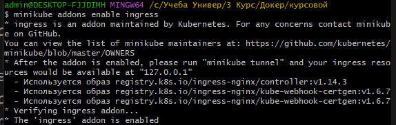

Рисунок 19 - включение аддона

После применения манифеста Ingress приложение становится доступным через IP-адрес кластера, который можно получить командой:

```bash
minikube ip
```
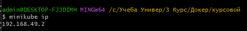

Рисунок 20 - получение ip


Таким образом, пользователь получает доступ к веб-интерфейсу приложения через браузер, обращаясь к IP-адресу Minikube.


# 3.8 Применение манифестов и проверка

После создания всех манифестов Kubernetes была выполнена их загрузка в кластер с помощью команды:

```bash id="p1"
kubectl apply -R -f k8s/
```
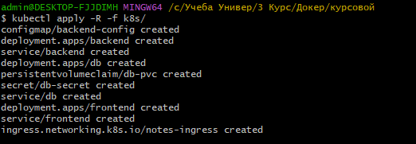

Рисунок 21 - загрузка образов в кластер

Kubernetes автоматически создал все необходимые ресурсы: Deployments, Services, Secret, ConfigMap, PVC и Ingress.

Для проверки состояния кластера использовались команды:

* `kubectl get all` — отображение всех основных ресурсов;
* `kubectl get pods -o wide` — проверка состояния Pod и их распределения;
* `kubectl get svc` — проверка сервисов;
* `kubectl get ingress` — проверка точки входа;
* `kubectl get pvc` — проверка подключенного хранилища.

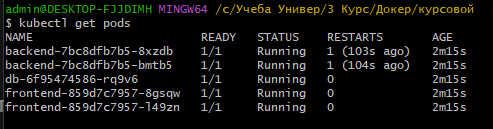

Рисунок 22 - проверка состояния pod

На момент проверки все основные компоненты (backend, frontend и database) находились в состоянии Running, что подтверждает корректное развертывание приложения в Kubernetes.

Для организации внешнего доступа был настроен Ingress-контроллер nginx. В локальной среде Minikube Ingress работает через механизм проброса трафика и требует активного процесса minikube tunnel для корректной маршрутизации запросов извне к сервисам внутри кластера.

В ходе тестирования было установлено, что доступ по IP-адресу Ingress (http://192.168.49.2) не открыл веб-приложение напрямую. Это связано с особенностями работы Minikube в локальной среде (Docker driver на Windows), где Ingress-IP не всегда функционирует как полноценный внешний адрес и требует дополнительной сетевой настройки (tunnel/port-forward) для обработки входящего трафика.

Доступ к приложению осуществлялся через Ingress-контроллер Kubernetes.
В локальной среде Minikube маршрутизация Ingress выполняется через механизм tunnel, который перенаправляет внешний трафик на сервисы внутри кластера.

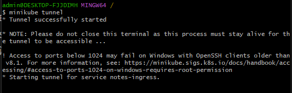

Рисунок 23 - открытие тунеля 


По этой причине для подтверждения работоспособности системы использовался альтернативный способ доступа:

http://localhost

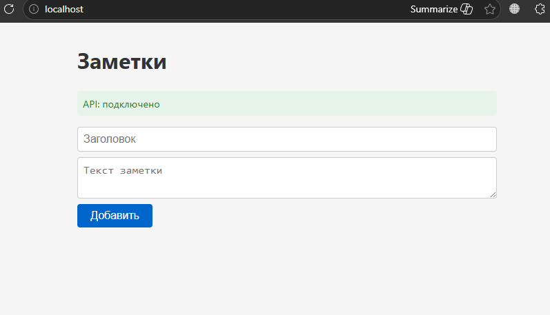

Рисунок 24 - проверка состояния api

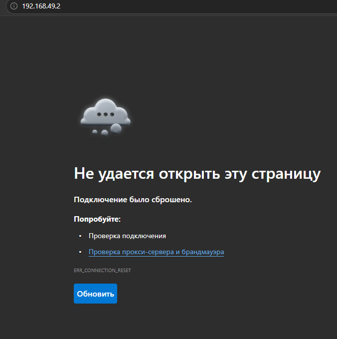

Рисунок 25 - проверка состояния api через ip


Данный способ обеспечивает корректное отображение веб-интерфейса и подтверждает работоспособность Ingress-цепочки (Ingress → Service → Pod) в кластере.


# Этап 4. Обновление и масштабирование

## 4.1 Rolling update 

В рамках данного этапа было выполнено обновление backend-сервиса без остановки работы приложения.

В исходный код backend был внесён функциональный изменения — добавлено поле версии в ответ эндпоинта /api/health:

res.json({ status: "ok", version: "2.0" });

После внесения изменений был пересобран Docker-образ с новым тегом:

```
docker build -t notes-backend:2.0 -f docker/backend/Dockerfile app/backend/
```
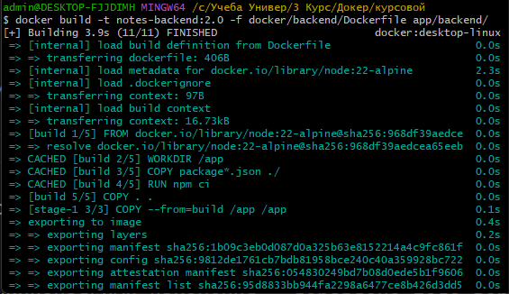

Рисунок 26 -пересобранный образ 

Далее образ был загружен в локальный кластер Minikube:

```
minikube image load notes-backend:2.0
```

Обновление Deployment было выполнено с использованием команды rolling update:
```
kubectl set image deployment/backend backend=notes-backend:2.0
```

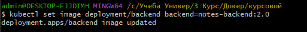

Рисунок 27 - обновление Deployment


Процесс обновления контролировался командами:

```
kubectl rollout status deployment/backend
kubectl get pods -w
```

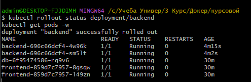

Рисунок 28 - контроль обновления


Во время обновления Kubernetes последовательно создавал новые Pod’ы с обновлённой версией приложения и удалял старые только после успешного прохождения readiness probe. Это позволило обеспечить непрерывную доступность сервиса.

## 4.2 Откат 

Был выполнен откат backend-сервиса к предыдущей версии после проведения rolling update.

Сначала была просмотрена история изменений Deployment с помощью команды ``` kubectl rollout history deployment/backend ```, где были выявлены две ревизии: первая — исходная версия приложения и вторая — версия после обновления.

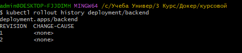

Рисунок 29 - история изменений 


Далее был выполнен откат к предыдущей версии с использованием команды ```kubectl rollout undo deployment/backend ``` . После этого Kubernetes автоматически начал процесс восстановления состояния приложения.

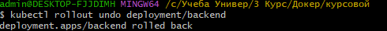

Рисунок 30 - откат версии


В ходе отката наблюдалась замена Pod-ов: новые Pod-ы удалялись, а вместо них запускались Pod-ы предыдущей версии ReplicaSet. Процесс контролировался командой  ``` kubectl rollout status deployment/backend ```, что позволило отследить последовательное обновление состояния кластера.

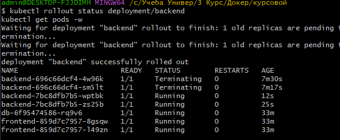

Рисунок 31 - контроль замены Pod-ов

Также была выполнена проверка текущего используемого образа через команду ``` kubectl describe deployment backend  ```, которая подтвердила возврат к предыдущей версии backend-сервиса.

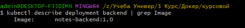

Рисунок 32 - проверка текущего образа

## 4.3. Horizontal Pod Autoscaler 
Для автоматического масштабирования backend-сервиса был настроен Horizontal Pod Autoscaler. Сначала был включен компонент metrics-server с помощью команды ``` minikube addons enable metrics-server ``` , который обеспечивает сбор метрик использования ресурсов в кластере.

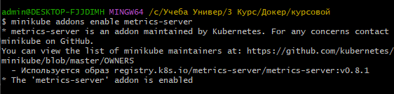

Рисунок 33 - включение компонента metrics-server

Далее была проверена конфигурация Deployment backend с помощью команды
``` kubectl describe deployment backend```, в результате чего было подтверждено наличие заданных ресурсов: requests.cpu и limits.cpu, необходимых для работы HPA.

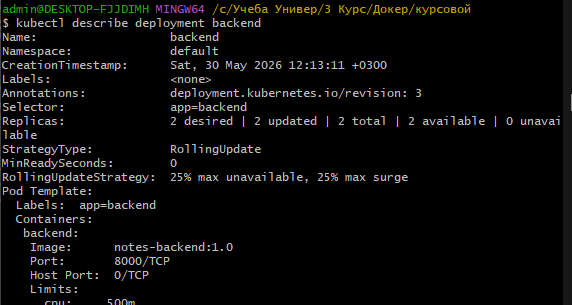

Рисунок 34 - проверка конфигурации


После этого был создан манифест Horizontal Pod Autoscaler в файле hpa.yaml, в котором указаны минимальное и максимальное количество реплик (от 2 до 5), а также целевая загрузка CPU — 50%.

После применения манифеста с помощью команды ``` kubectl apply -f k8s/backend/hpa.yaml ```  был создан объект автоматического масштабирования. Далее была создана нагрузка на backend-сервис с использованием бесконечного цикла HTTP-запросов через busybox.

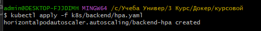

Рисунок 35 - применение манифеста


В процессе выполнения нагрузки наблюдалось автоматическое изменение количества Pod-ов backend-сервиса, что подтверждается выводом команд ``` kubectl get hpa и kubectl get pods -w ```, где фиксировалось динамическое масштабирование реплик в зависимости от нагрузки.

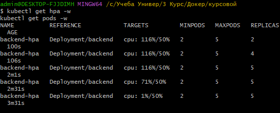

Рисунок 36 - наблюдение за изменением кол-ва Pod-ов

## 4.4. Автоматическое восстановление

Для демонстрации механизма автоматического восстановления Kubernetes был выполнен ручной удаление одного Pod backend-сервиса с помощью команды ``` kubectl delete pod backend-7bc8dfb7b5-wptbk ```

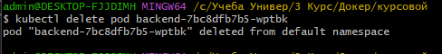

Рисунок 37 - удаление Pod backend


После удаления Pod-а система Kubernetes зафиксировала несоответствие заданному состоянию Deployment, в котором указано поддержание двух реплик backend-сервиса. В результате контроллер Deployment автоматически инициировал создание нового Pod-а для восстановления требуемого количества экземпляров приложения.

Процесс восстановления был зафиксирован с использованием команды ```kubectl get pods -w ```, где наблюдалось последовательное удаление старого Pod-а и запуск нового Pod-а backend-сервиса. При этом новый Pod был создан практически сразу после удаления предыдущего, что подтверждает работу механизма self-healing.

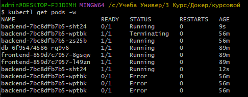

Рисунок 38 - демонстарция Pod-ов

Состояние Error, появившееся у удаляемого Pod-а, объясняется тем, что процесс был принудительно завершен Kubernetes во время его работы. При принудительном удалении контейнер не успевает корректно завершить выполнение, что приводит к фиксации промежуточного состояния ошибки до полного завершения процедуры удаления.

Таким образом, Kubernetes автоматически поддерживает заданное количество реплик приложения, обеспечивая непрерывную доступность сервиса даже при ручном удалении отдельных Pod-ов, без необходимости вмешательства пользователя.


# Этап 5. Безопасность

## 5.1. Использование непривилегированного пользователя

В рамках повышения безопасности контейнерной среды была выполнена проверка пользователя, от которого запускаются процессы в Docker-образах backend и frontend.

Для проверки использовались команды:

```
docker run --rm notes-backend:1.0 whoami
```

Результат выполнения:

```
node
```

Далее была выполнена проверка frontend-образа:
```
docker run --rm notes-frontend:1.0 whoami
```

Результат выполнения:
```
appuser
```
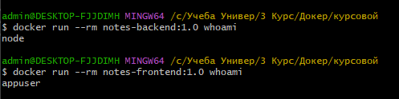

Рисунок 39 - проверка пользователя 


Таким образом, было подтверждено, что оба контейнерных приложения запускаются от непривилегированных пользователей, что соответствует требованиям безопасности и исключает запуск процессов от root-пользователя.

# 5.2 SecurityContext в манифестах Kubernetes

В рамках этапа повышения безопасности контейнерной среды в манифесты Deployment для backend и frontend была добавлена секция securityContext. Основное внимание было уделено ограничению привилегий контейнеров за счёт параметра allowPrivilegeEscalation: false, который запрещает процессам внутри контейнера повышать уровень привилегий.

После внесения изменений и применения обновлённых манифестов Kubernetes пересоздал Pod-ы с новой конфигурацией. В результате в кластере были запущены новые версии Pod-ов, однако часть из них первоначально переходила в состояние CreateContainerConfigError.

В ходе анализа логов и описания Pod-ов было выявлено, что дополнительное ограничение запуска контейнеров от непривилегированного пользователя (runAsNonRoot) вызывает конфликт с используемыми образами, поскольку в них применяется именованный пользователь , который не может быть корректно интерпретирован Kubernetes как непривилегированный с точки зрения UID. Это приводило к невозможности запуска контейнеров.
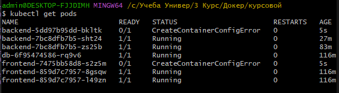

Рисунок 40 - ошибка 

Для восстановления работоспособности системы было принято решение исключить параметр runAsNonRoot и оставить только ограничение allowPrivilegeEscalation: false, что позволило сохранить базовый уровень безопасности без нарушения запуска приложений.

После корректировки конфигурации и повторного применения манифестов Pod-ы были успешно пересозданы, старые экземпляры были корректно завершены, а новые контейнеры запущены и переведены в состояние Running. Система была восстановлена и продолжила функционировать в штатном режиме.

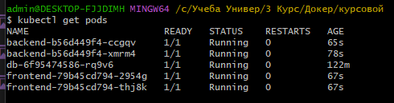

Рисунок 41 - финальное состояние 

# 5.3  Сканирование образов на уязвимости

В ходе выполнения работы был проведён анализ безопасности Docker-образа backend-приложения notes-backend:1.0 с использованием инструмента Trivy (Aqua Security), предназначенного для выявления известных уязвимостей (CVE) в зависимостях контейнеров и системных библиотеках. Сканирование выполнялось путём запуска контейнера Trivy с подключением Docker-сокета хоста, что позволило инструменту получить доступ к локальному образу и провести его полное сканирование.

В процессе анализа были проверены установленные зависимости Node.js, а также системные пакеты, входящие в состав образа. По результатам сканирования было обнаружено в общей сложности 4 уязвимости, среди которых 3 относятся к среднему уровню (MEDIUM) и 1 к высокому уровню (HIGH). Критических уязвимостей (CRITICAL) выявлено не было.

Выявленные уязвимости связаны с популярными библиотеками Node.js, используемыми в проекте. В частности, уязвимость высокого уровня была обнаружена в библиотеке picomatch и связана с возможностью проведения атаки типа ReDoS (Regular Expression Denial of Service), которая может привести к значительному замедлению или зависанию приложения при обработке специально сформированных входных данных. Также уязвимости среднего уровня были обнаружены в библиотеках brace-expansion и ip-address и связаны с потенциальными проблемами обработки шаблонов и IP-адресов.

Несмотря на наличие уязвимостей, критических угроз безопасности в образе выявлено не было, что говорит о приемлемом базовом уровне безопасности контейнера. Однако наличие уязвимости высокого уровня требует внимания и обновления зависимостей проекта.

Для повышения уровня безопасности рекомендуется обновить используемые библиотеки до актуальных версий, пересобрать Docker-образ и регулярно проводить повторное сканирование при внесении изменений в проект.


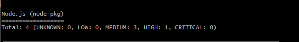

Рисунок 42 - сканирование backend


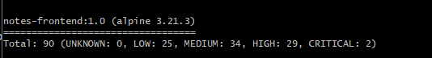

Рисунок 43 - сканироване frontend


# Заключение

В ходе выполнения курсового проекта была разработана и развернута полноценная инфраструктура веб-приложения, включающая этапы контейнеризации, оркестрации и обеспечения базовой безопасности. В результате проект был преобразован из исходного кода в полностью функционирующую распределённую систему, готовую к запуску в контейнеризированной среде.

На этапе контейнеризации были созданы Docker-образы backend- и frontend-частей приложения. Применение многоэтапной сборки позволило оптимизировать размер образов за счёт исключения лишних зависимостей и промежуточных файлов сборки. Также были внедрены базовые меры повышения безопасности, включая использование непривилегированных пользователей внутри контейнеров и ограничение прав доступа через настройки контейнеров.

На этапе организации многоконтейнерной среды с использованием Docker Compose была реализована связка приложения с базой данных PostgreSQL. Были настроены сетевые взаимодействия между сервисами, а также обеспечено сохранение данных с использованием томов, что гарантировало устойчивость системы при перезапуске контейнеров.

В рамках оркестрации с использованием Kubernetes были разработаны и применены манифесты для развертывания всех компонентов системы, включая Deployments, Services, ConfigMap, Secret, PersistentVolumeClaim и Ingress. Приложение было успешно развернуто в локальном кластере и обеспечено внешним доступом через Ingress-контроллер. Дополнительно были продемонстрированы механизмы управления жизненным циклом приложения, такие как rolling update, rollback, горизонтальное масштабирование (HPA) и автоматическое восстановление подов при сбоях.

На этапе обеспечения безопасности был проведён анализ Docker-образов с использованием инструмента Trivy, который выявил наличие уязвимостей различного уровня в сторонних зависимостях. Полученные результаты подтвердили необходимость регулярного обновления библиотек и базовых образов для поддержания актуального уровня безопасности системы.

Таким образом, в рамках курсового проекта была реализована комплексная система контейнеризации и оркестрации веб-приложения, включающая все ключевые этапы жизненного цикла современного приложения: сборку, развертывание, масштабирование и базовую защиту, что соответствует современным подходам к разработке и эксплуатации облачных сервисов.


